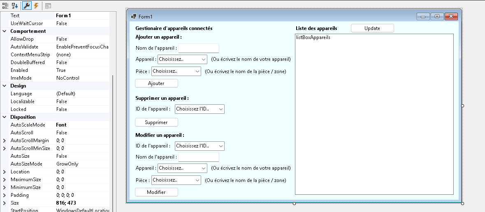
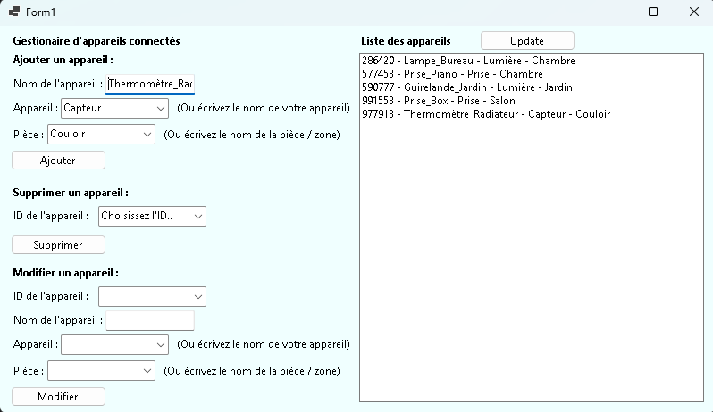
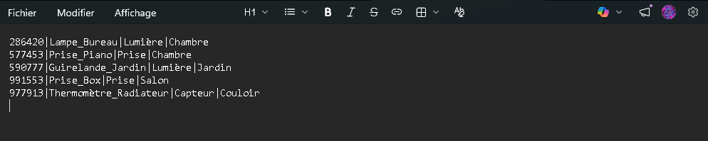

# Preuves - Application de Gestion (C#)

## 1. L'Interface Graphique (Conception)
L'application a été développée avec Windows Forms sous l'environnement JetBrains Rider. Elle permet à l'utilisateur de gérer visuellement les appareils grâce à différents éléments (Boutons, ListBox, ComboBox, TextBox).

*Aperçu de la création de l'interface en mode "Designer".*

## 2. L'Application en Fonctionnement
Voici le résultat final une fois l'application lancée. L'utilisateur peut ajouter un appareil (ex: Ordinateur, Télévision) et l'affecter à une pièce. L'application génère automatiquement un ID aléatoire à 6 chiffres pour chaque enregistrement.

*Exemple d'utilisation : ajout et affichage en temps réel dans la liste.*

## 3. Stockage et Persistance des Données
Pour simuler une base de données de manière simple, l'application lit et écrit dans un fichier texte (Appareils.txt). Les données y sont structurées ligne par ligne, en utilisant le symbole | comme séparateur.

*Aperçu du fichier : on y retrouve bien l'ID, le nom, le type et la pièce pour chaque appareil enregistré.*

