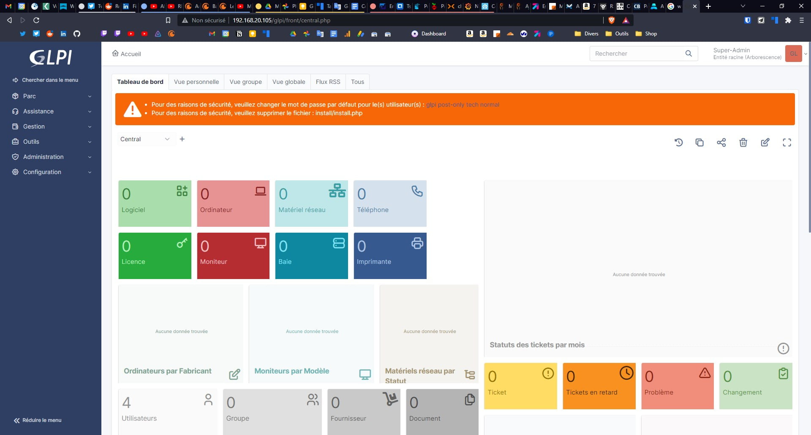

# Preuves - Exercices GLPI (Gestion de Parc & Support)

Ce document récapitule les travaux pratiques réalisés sur la plateforme GLPI lors du premier semestre du BTS SIO.

## Aperçu Visuel

*Interface de gestion GLPI utilisée pour les exercices.*

## TP1 : Prise en main et Inventaire Manuel
- Création de la structure du parc : Lieux (Toulouse, Cugnaux), Fabricants (HP, Asus, Dell), Statuts (Neuf, HS).
- Enregistrement de postes clients selon un plan de nommage strict.
- Gestion logicielle : Déclaration des licences, suivi des versions (Windows 10, Office) et gestion des expirations.

## TP2 : Inventaire Automatique (Agent GLPI)
- Transition de la saisie manuelle (chronophage pour un grand parc) vers une remontée automatisée.
- Déploiement virtuel de l'agent GLPI pour la collecte d'informations.
- Configuration du dictionnaire de logiciels pour exclure les programmes non pertinents des rapports.

## TP3 : Gestion des Tickets d'Incidents
- Mise en place de la hiérarchie de support via la création de rôles (Self-Service, Hotline, Technicien, Manager).
- Déroulement d'un scénario complet de ticketing :
  - **Déclaration :** Signalement d'écrans bleus et de perte réseau par les utilisateurs.
  - **Prise en charge :** Triage et assignation par niveau de priorité.
  - **Résolution :** Dialogue dans le ticket, proposition de solutions (Mise à jour pilote, config réseau) et clôture.
