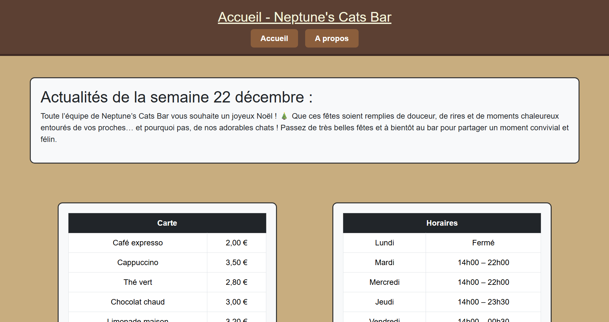
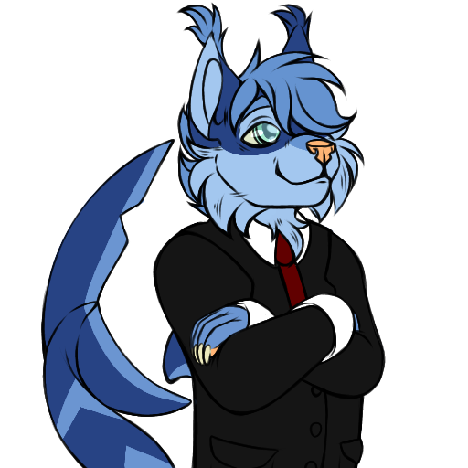

# Preuves - Site Bar à Chats (Neptune's Cats Bar)

## 1. Aperçu du Site Web (Front-End)
Le site a été développé de zéro pour répondre à l'exercice de création d'un bar à thème. L'interface utilise HTML, CSS et Bootstrap pour garantir un affichage moderne et responsif.

*Page d'accueil du Neptune's Cats Bar.*

## 2. Identité Visuelle et Intégration
Le projet a également nécessité un travail d'intégration d'assets graphiques (comme la mascotte Neptune) et une structuration pensée pour le référencement (SEO).

*Mascotte utilisée pour l'identité visuelle du site.*

## 3. Aspects Techniques (Back-End)
Le site intègre également des notions de JavaScript (pour l'interactivité côté client) et de PHP (pour la logique serveur et la dynamisation du contenu). Les 5 différents rendus du projet ont permis de valider la progression technique tout au long de l'année.
